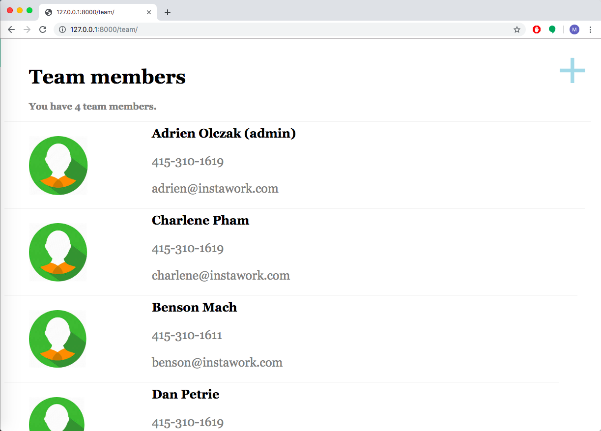
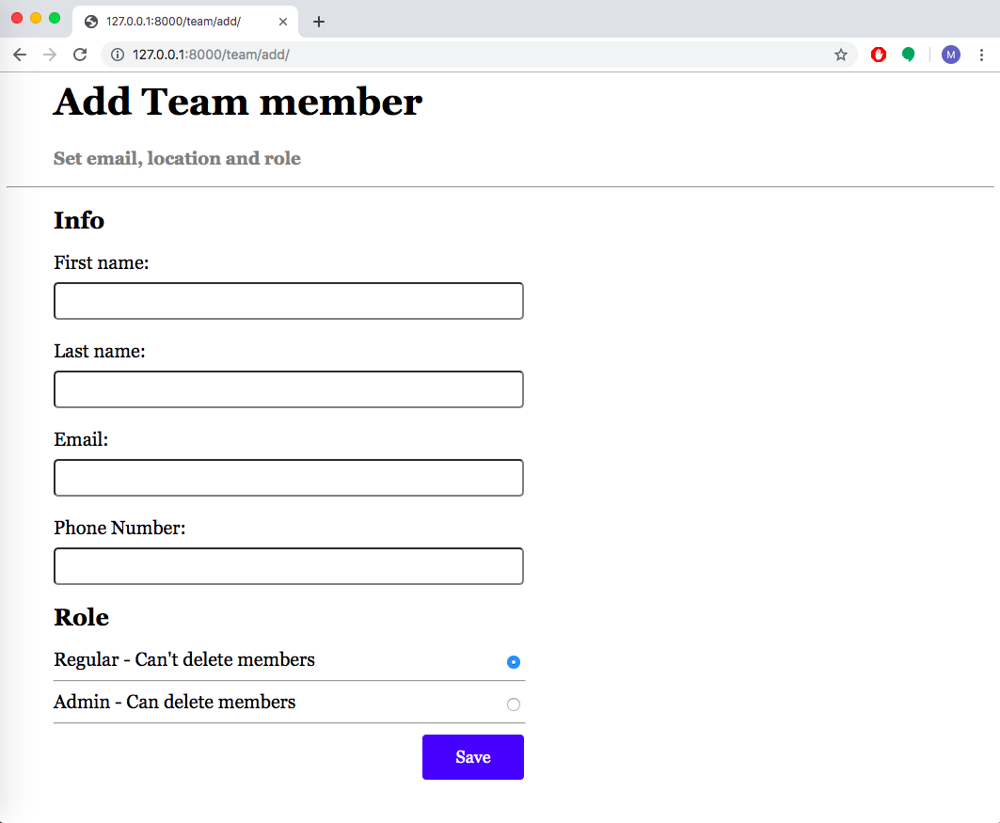
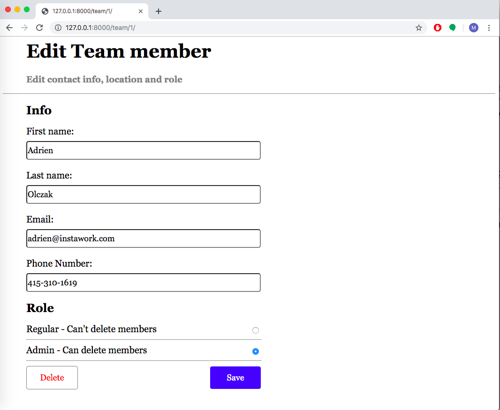

# Django Team Member Management Web Application
Team-member management application that allows the user to view, edit, add, and delete team members.

Implemented using Django framework.

App consists of three pages, a List page displaying the current team members, an Add page to add a new team member, and an Edit page to edit the information of a current team member.

# Pages

# List Page

This page shows a list of all team members. Also note that if the team member is an admin, that is listed next to their name. Clicking a team member should show the Edit page. Clicking the plus at the top should show the Add page.



# Add Page

The Add page appears when the user clicks the "+" on the List page. The user enters a team member's first & last name, their phone number, and email. Additionally, they can choose the team member's role (it defaults to regular). Hitting save adds the team member to the list and shows the List page.



# Edit Page

The Edit page appears when the user clicks a team member on the List page. This shows a form where the user can edit the details of the team member, including changing their role. Clicking save edits the team member information and shows the List page. Clicking Delete removes the team member and returns to the List page.



# Setup
To run the web application, you need to have Django installed. See the django docs to learn how to install Django (https://docs.djangoproject.com/en/2.2/intro/install/)

# Usage
Navigate to the directory where you cloned/downloaded the files on this repository in your terminal.

If you run
```bash
ls
```
you should see a "manage.py" file, a "team_site" folder, a "team" folder, an "images" folder, and a "db.sqlite3" file.

You can start the web application by running
```bash
python manage.py runserver
```

now it will start the webapp at http://127.0.0.1:8000/

to go to the List Page, use extension 'team/' (http://127.0.0.1:8000/team/)

clicking on any of the team members on the List Page will redirect you to the Edit Page

clicking on the "+" button on the top right of the List Page will redirect to the Add Page
